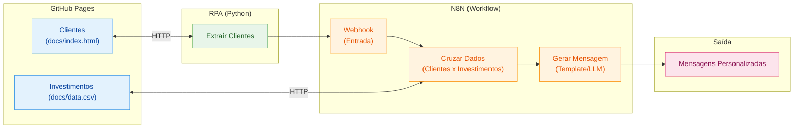

# Criando um Assistente de Investimentos com RPA e IA Generativa

## Descrição

Aprenda na prática como criar um fluxo de automação inteligente combinando técnicas de RPA (Robotic Process Automation) com workflows de IA no N8N.

Neste desafio, você vai construir um assistente de investimentos automatizado. O fluxo começa com a extração de dados de clientes em uma página web usando Python, passa pela orquestração de um workflow no N8N e termina com a geração de mensagens personalizadas para cada perfil de investidor.

O projeto foi pensado para ser simples e acessível, mesmo para quem está dando os primeiros passos em Python e automação. A ideia é que você entenda o conceito de RPA de forma leve e aplique tudo em um cenário realista do mercado financeiro.

## Objetivo do Projeto

Desenvolver um pipeline de automação que:

1. **Coleta dados de clientes** de uma página web simulada usando Python
2. **Processa as informações** através de um workflow no N8N
3. **Cruza perfis de investidor** com uma base de opções de investimento
4. **Gera mensagens personalizadas** para cada cliente

Ao final, você terá um sistema funcional que demonstra como empresas do setor financeiro podem automatizar a comunicação com clientes de forma inteligente.

## Arquitetura do Projeto



## Tecnologias e Ferramentas

O projeto utiliza ferramentas gratuitas e acessíveis, organizadas conforme cada etapa do fluxo:

| Etapa | Ferramenta | Função |
|-------|-----------|--------|
| Hospedagem | GitHub Pages | Servir a página de clientes e o CSV de investimentos |
| Extração (RPA) | Python + BeautifulSoup | Coletar dados dos clientes via web scraping |
| Orquestração | N8N | Processar dados, cruzar perfis e gerar mensagens |
| Geração com IA | Agente de IA no N8N | Criar mensagens personalizadas com LLM (desafio extra) |

Além dessas, você pode usar IAs generativas como **Gemini**, **Claude** ou **ChatGPT** como copilotos para auxiliar na escrita de código e tirar dúvidas ao longo do desenvolvimento.

## Roteiro do Desafio

### Etapa 1: Entenda o Projeto

Antes de começar, explore o repositório base que já contém a estrutura inicial:

1. **Página de Clientes (`docs/index.html`):** Uma página HTML hospedada no GitHub Pages com uma lista de clientes fictícios contendo nome, email, saldo e perfil de investidor (Conservador, Moderado ou Arrojado). Disponível online [neste link](https://digitalinnovationone.github.io/dio-lab-assistente-investimentos-rpa-n8n).
2. **Dados de Investimentos (`docs/data.csv`):** Um arquivo CSV também hospedado no GitHub Pages com opções de investimento organizadas por perfil. Disponível online [neste link](https://digitalinnovationone.github.io/dio-lab-assistente-investimentos-rpa-n8n/data.csv).
3. **Script de RPA (`rpa/extrair_clientes.ipynb`):** Um notebook Python que acessa a página de clientes e extrai os dados da tabela usando BeautifulSoup.

> 🤖 **Por que o script é considerado RPA?** Ele faz exatamente o que um humano faria manualmente: abre uma página, lê os dados de uma tabela e os envia para outro sistema. A diferença é que o "robô" (código) executa isso automaticamente. Essa abordagem é útil quando não existe uma API disponível ou quando precisamos integrar sistemas legados.

### Etapa 2: Configure o Ambiente

1. Faça um **fork** do repositório base para sua conta do GitHub
2. Crie uma conta no [N8N Cloud](https://n8n.io/) ou instale localmente
3. Abra o notebook `rpa/extrair_clientes.ipynb` no [Google Colab](https://colab.research.google.com/) e execute para entender o fluxo de extração

> 💡 **Atenção:** O script já extrai os dados, mas o envio ao N8N está comentado (`TODO`). Você vai configurar a URL do Webhook após criá-lo na próxima etapa.

### Etapa 3: Desenvolva o Workflow no N8N

Este é o coração do desafio! Monte um fluxo que:

1. Receba os dados dos clientes via Webhook (copie a URL gerada e configure no script Python)
2. Leia o arquivo `docs/data.csv` com as opções de investimento
3. Cruze o perfil de cada cliente com a opção adequada
4. Gere uma mensagem de recomendação para cada cliente

### Etapa 4 (MVP): Mensagens Estáticas

Para a versão mínima, use templates de mensagem fixos baseados no perfil:

- **Conservador:** Foco em renda fixa e segurança
- **Moderado:** Mix equilibrado entre renda fixa e variável
- **Arrojado:** Ênfase em ações e maior potencial de retorno

### Etapa 5 (Desafio): Integração com IA Generativa

Conecte o Agente de IA do N8N a um modelo como Gemini ou GPT para:

- Analisar o contexto do cliente (saldo, perfil)
- Gerar mensagens únicas e personalizadas
- Criar recomendações mais inteligentes e humanizadas

## Entregáveis

### MVP (Mínimo Viável)

- [ ] Repositório forkado com o workflow N8N implementado
- [ ] Workflow N8N exportado (`n8n/workflow.json`) com mensagens estáticas
- [ ] Script de RPA integrado ao Webhook do N8N
- [ ] Print ou vídeo demonstrando o fluxo funcionando de ponta a ponta

### Desafio Completo

- [ ] Todos os itens do MVP
- [ ] Integração com Agente de IA no N8N
- [ ] Mensagens geradas dinamicamente via LLM
- [ ] Documentação explicando as decisões técnicas

## Estrutura do Repositório

```
📁 dio-lab-assistente-investimentos-rpa-n8n/
├── 📄 README.md
├── 📁 n8n/
│   ├── 📄 README.md                # 📘 Documentação do workflow e decisões técnicas da automação
│   ├── 📄 workflow.json            # 🎯 Artefato esperado: exportação versionada e reproduzível do fluxo MVP
│   └── 📄 *.json                   # 🧪 Exportações auxiliares (exemplos/variações de fluxo)
├── 📁 rpa/
│   └── 📄 extrair_clientes.ipynb   # ✅ Notebook Python (extração + envio para Webhook)
└── 📁 docs/
    ├── 📄 index.html               # ✅ Página de clientes (já implementado)
    └── 📄 data.csv                 # ✅ Opções de investimento (já implementado)
```

## Pasta `n8n`: finalidade e uso no desafio

A pasta `n8n/` concentra os artefatos do workflow de orquestração entre a coleta em Python e a geração de recomendações. O artefato principal esperado para o desafio é o arquivo `n8n/workflow.json`, que representa uma exportação **versionada e reproduzível** do fluxo no n8n.

### Fluxo esperado dos nós

No MVP, o fluxo deve seguir esta sequência:

1. **Webhook (entrada):** recebe `POST` com a lista de clientes enviada pelo notebook Python.
2. **Leitura/consulta de investimentos:** busca `docs/data.csv` (via GitHub Pages) com as opções por perfil.
3. **Cruzamento por perfil:** relaciona cada cliente (`Conservador`, `Moderado`, `Arrojado`) com a linha apropriada do CSV.
4. **Geração da mensagem:** monta a recomendação (template estático no MVP, com possibilidade de evolução para IA).
5. **Resposta/saída:** retorna os resultados para inspeção (response node, logs ou outro destino de saída definido no fluxo).

### Importação no n8n e teste ponta a ponta

1. No n8n, use **Import workflow** e selecione `n8n/workflow.json` (quando disponível no repositório).
2. Copie a URL do nó **Webhook** e atualize a variável correspondente no notebook `rpa/extrair_clientes.ipynb` (ex.: `N8N_WEBHOOK`).
3. Execute o notebook para extrair clientes e enviar o payload JSON para o n8n.
4. Valide no n8n se o fluxo processou os dados, cruzou perfis corretamente e gerou uma mensagem para cada cliente.
5. Revise o retorno final (HTTP response, console do n8n ou nó de saída configurado) para confirmar o funcionamento ponta a ponta.

### Boas práticas de segurança para versionamento

- Não versionar credenciais de produção, tokens de API ou chaves secretas.
- Não versionar URLs privadas/sensíveis (por exemplo, webhooks temporários de túnel) sem sanitização.
- Não usar dados pessoais reais de clientes; manter apenas dados fictícios/anônimos.
- Revisar exportações do n8n antes do commit para remover campos sensíveis.

### Decisões técnicas

- **Webhook como contrato de entrada:** padroniza a integração entre coleta (Python/RPA) e orquestração (n8n), com payload JSON simples e desacoplado.
- **CSV no GitHub Pages como fonte inicial:** fornece base transparente, pública e fácil de auditar para mapear perfil de investidor para sugestão de investimento.
- **Separação de responsabilidades:** Python realiza coleta/normalização de dados, n8n orquestra regras de negócio e a camada de saída apresenta a recomendação.
- **MVP com mensagens estáticas por perfil:** reduz complexidade inicial, acelera validação funcional e prepara terreno para evolução (substituição do nó por agente/LLM).
- **Validação mínima e tratamento de erros:** o fluxo deve validar campos essenciais (`nome`, `email`, `saldo`, `perfil`) e tratar entradas ausentes/ inválidas; as recomendações são demonstrativas e não configuram consultoria financeira.

## Prompts Úteis para Copilotos de IA

| Tarefa | Sugestão de Prompt |
|--------|-------------------|
| Gerar dados fictícios | "Crie 10 clientes fictícios com nome, email, saldo e perfil de investidor em JSON" |
| Entender código | "Explique o que faz a biblioteca BeautifulSoup em Python" |
| Debugar erros | "Meu script Python está dando erro X, o que pode ser?" |
| Montar workflow | "Como configuro um webhook no N8N para receber dados JSON?" |

## Referências

- [Documentação do N8N](https://docs.n8n.io/)
- [BeautifulSoup: Web Scraping com Python](https://realpython.com/beautiful-soup-web-scraper-python/)
- [GitHub Pages: Guia Rápido](https://pages.github.com/)

---

**Bons estudos e mãos à obra** 🚀

Se tiver dúvidas, lembre-se: a melhor forma de aprender é experimentando. Erre, corrija e celebre cada pequena vitória no caminho.
